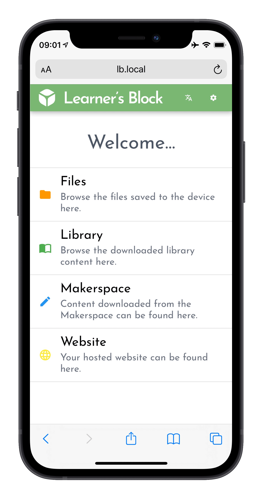

# Learner's Block

## What is a Learner's Block?

Learner's Block is an open-source project that lets individuals and organisations provide their educational resources, websites and apps to users offline.

Upload your content, stick the Block in your pocket and take it where it needs to be. Users connect directly to the Block with their computer, phone, tablet or other Wi-Fi enabled device and access your content offline. 

**Key Features:** 

* Multilingual
* Automatic updates
* Upload your own content, or content created by others
* Mirror your pre-built website to the Block for offline access

## Who is it for?

Everyone and anyone. While we have built the Block with education in emergencies in mind, Learner’s Block is intentionally non-prescriptive. Look at its features and flexibility, and feel free to use it as you see fit, in the sectors you feel can benefit. 

## Where can I get one?

Right here. Learner’s Block is software available for download for free from our website. It is designed to be deployed on hardware you can afford where you are and provides a range of compatible options. Many of our users opt for Raspberry Pi’s and Orange Pi’s due to their large distribution network and low costs. For instructions on how to install the software, check out our [Quickstart](how-to-build-one/quickstart/) guide. 

