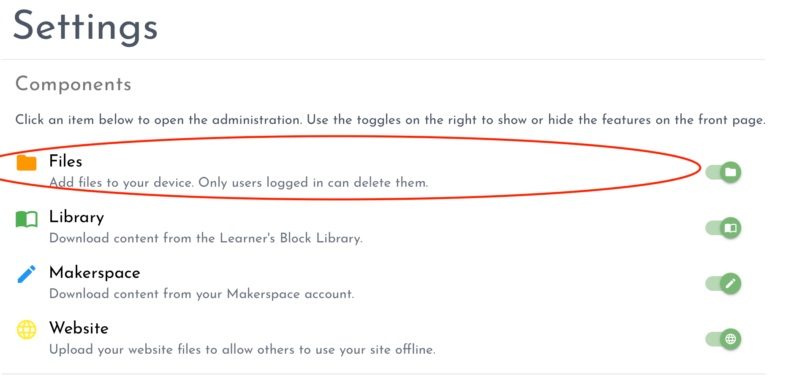
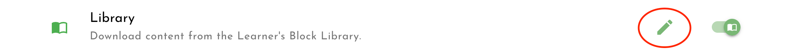

# Adding content

There are a multitude of ways to add a range of content to your device. 

1. Through your browser
2. From the Learner's block Library
3. Form a USB Drive

Click a tab below to explore each. 



## Files and Folders

[Connect to your device](how-to-connect.md), and login to the Control Panel by clicking the Settings cog at the top right of the interface.  

Under the 'Components' panel, click anywhere on the 'Files' row:

A File Manager will open, where you can upload files and folders. Open the folder named 'Files', and begin uploading your content. 

When a user clicks on the 'Files' row on the first page of the Block, they will see all the files you have uploaded, but don't worry, only those who have access to the Control Panel can delete, move or change them. 

## Websites

A special folder exists on the Block called 'Websites'. This folder works differently than the others. When users of the Block view the content you add in this folder, they will not see files and folders like in the 'Files' component detailed above. Instead, the folder is treated like a web server, where index.html and index.php are sought and opened as webpages when available. 

To add content, [connect to your device](how-to-connect.md), and login to the Control Panel by clicking the Settings cog at the top right of the interface.  

Under the 'Components' panel, click anywhere on the 'Website' row:

The File Manager will open the Website directory where you can upload your website files. 

When a user clicks on the 'Website' menu on the first page of the Block, they will be directed to the content stored here, where it will open as a webpage. 



## Add content

If you would like to add resources from the Learner's Block Library, [connect to your device](how-to-connect.md) and login to the Control Panel by clicking the Settings cog at the top right of the interface.

Under the 'Components' panel, click anywhere on the 'Library' row:


You will need to be connected to the internet for this feature to work, otherwise the Block will not be able to download the content. 


A new window will open that will take you to the Learner's Block Library. Once you have found the resource you want to download, click the `Download` button. 

When a user clicks on the 'Library' menu on the first page of the Block, they will see all the Library items you have downloaded.

## Delete or edit content

If you want to delete Library content later, navigate to the Control Panel and click on the `Edit` icon next to the Library toggle:




Plug your USB Drive into your Block.

Under the 'Components' panel, click anywhere on the 'Files' row:

A File Manager will open. Open the folder called 'Files' and you will see a new directory named after your USB Drive. You can leave the Drive plugged in and use the content directly, or you can copy or move the content to the Block.

When a user clicks on the 'Files' row on the first page of the Block, they will also see the USB Drive folder while the USB Drive is plugged in. 




You can see the space available on your device at the bottom of the Control Panel. 


