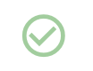

# Changing the Wi-Fi SSID and URL

## Choosing your own Wi-Fi SSID and URL


SSID stands for “Service Set Identifier”. The SSID is the name of the Wi-Fi network that you see when you connect to Wi-Fi hotspots on your computers, phones and tablets. By default the Learner's Block SSID is 'Learners-Block'.


**By default, the URL to access your Block is:**

> lb.local

**The default Wi-Fi SSID is:**

> Learners-Block

**If you want to set your own, you can do so in the Control Panel:**

1. Click the settings cog in the top right of the navigation
2. Click `Advanced` tab at the top of the page
3. In the `Change URL and Wi-Fi SSID` section, type a new name in the field.
4. Click the green tick button to apply the change:  &#x20;
5. Restart your Block.


URL and Wi-Fi SSIDs must be a maximum of 32 characters and have no special characters other than `_` and `-`



You can restore the original URL and Wi-Fi SSID by changing you hostname back to `lb`


### **Here is an example:**

In the settings panel, I change my URL and Wi-Fi SSID to:

> my-school-name

After restarting my Learner's Block, its Wi-Fi network name is now:

> my-school-name

To visit my Block, in my browser I type:

> http://my-school-name.local

## Using Multiple Blocks on the Same Network

When multiple Blocks are connected to the same nearby router, your phones, laptops and tablets will not know which one you want to connect to when typing in `http://lb.local`or choosing a Wi-Fi network.&#x20;

In these scenarios, you can follow the instructions above to set a custom Wi-FI network name and URL.
