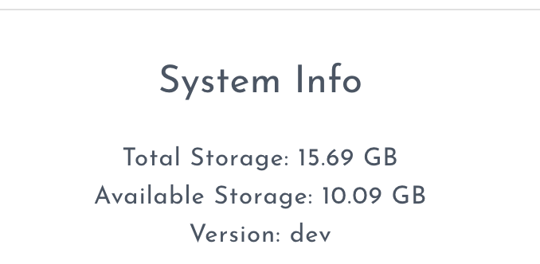

# Checking the Remaining Space

You can find out how much space is left on your Block in the Control Panel.

Click the Settings cog in the top right of the screen.

Click the Advanced tab at the top of the page:

Scroll to the bottom of the page to find information on the remaining space:

