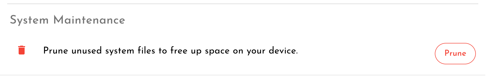

# Pruning System Files

Some files accumulated over time are kept on the device for speed and offline access. These include:

* Docker images of downloaded applications from the [Application Store](../installing-from-the-application-store.md)

These files are kept for speed and convenience when using your device. If, however, you need to free up space on your SD card you can prune these files without any major impacts to your device.


Here is an example. When you install applications from the [Application Store](../installing-from-the-application-store.md) and then [remove them](../installing-from-the-application-store.md#removing-an-application) again, the application's system files are kept on the device for your easy offline installation later. If, however, you would rather have the space back, you can prune these files using the Prune button. 

**Note,** however, that this will not remove your application data and settings that are used by the application manufacturer to customise the app to you. Therefore, if you reinstall the application later, your settings will be restored. If you want to remove these files, do so through the applications own interface. 


In order to prune system files, click the settings icon in the top right of the interface. Click the 'Advanced' tab. 

Scroll to the bottom and you will find a `Prune` button under the 'System Maintenance' heading:

