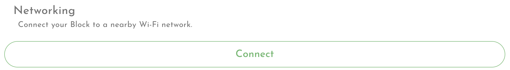
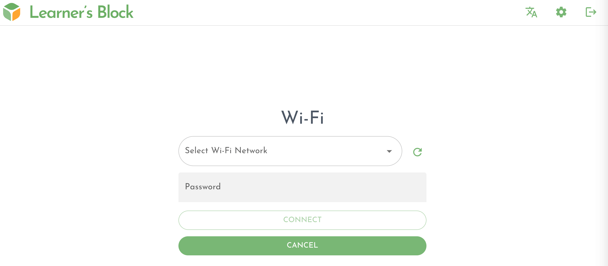

# Connecting to a Wi-Fi network \(Optional\)

## Connecting

Your Block will work perfectly well offline. But if you have access to another Wi-Fi network nearby connecting your Block to it can provide a series of benefits:

1. Your Block can access the internet to fetch updates
2. Your Block can handle more users connected simultaneously by using the available Wi-Fi instead of the built-in Wi-Fi. 
3. Your users will not need to be close to the Block to access it

In order to connect to a network, click the Settings toggle in the top right of the interface.

Under the Networking section, click 'Connect'

A new window will open displaying a list of available networks, and asking for a password:

Complete the fields and hit connect. If you entered the details correctly, your Block will be available on your chosen network after a short period. 


If you do not see the Wi-Fi network you are looking for press the refresh button or try restarting the Block and try again.


You can now access the Block with the following steps:

1. Connect your phone, tablet laptop or other device to the same network, either via Wi-Fi or an ethernet cable
2. Visit your Learner's Block just like before, using [the URL](how-to-connect.md) in your browser

If you entered the wrong password, your Block will soon reappear in your list of available Wi-Fi hotspots. Connect and try again. 

## Disconnecting

In order to disconnect from a network, click the Settings toggle in the top right of the interface.

Under the Networking section, click 'Disconnect':

