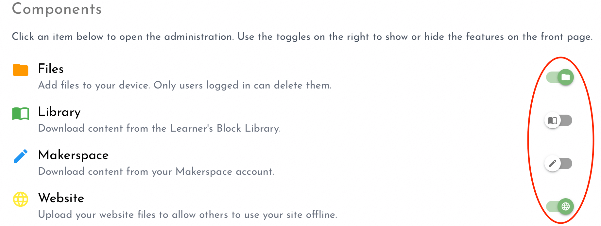
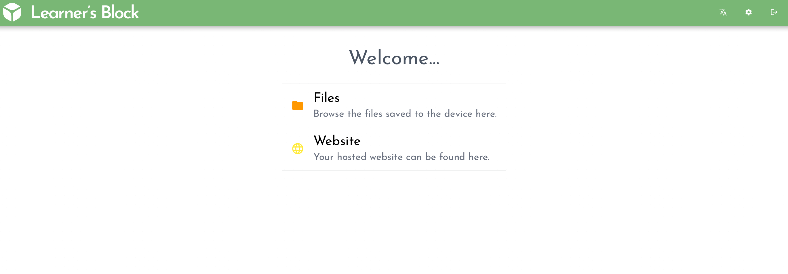

# Enabling components

A Learner's Block is packed with features. But not everyone will need them all. That is why we let you disable the ones you do not need to prevent users from seeing unnecessary buttons. Click on the Settings cog in the top right of the interface .

Under the 'Components' section, use the toggles on the right to enable or disable components:

By disabling the two middle features as we can see in the image above, the entry page of your Block will change from this:

to this:

