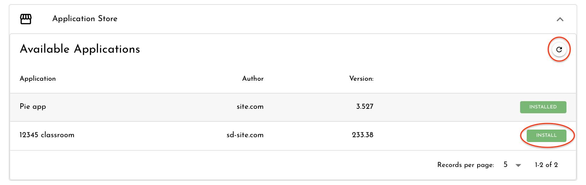
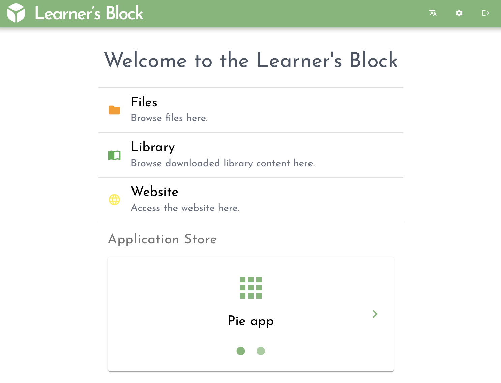
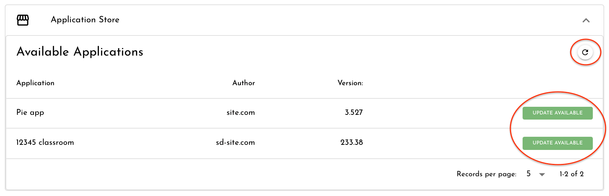
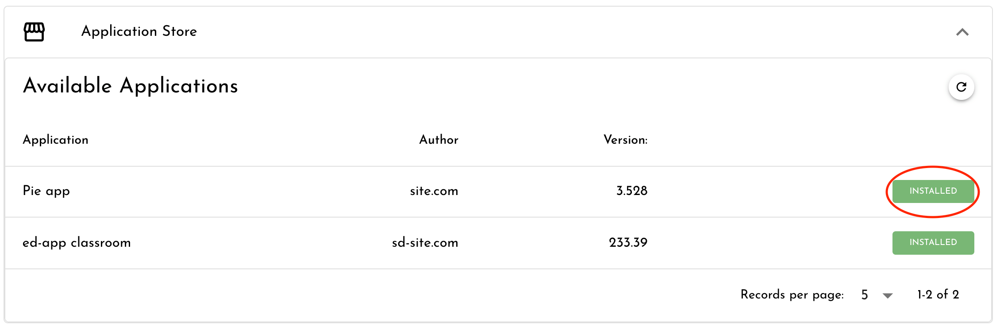

# Installing from the Application Store

Your Learner's Block has an Application Store allowing on-click installation of popular EdTech platforms. 

To install from the Application Store, you will need:

1. Internet connectivity via [Wi-Fi ](connecting-to-a-wi-fi-network-optional.md)or [Ethernet](advanced-features/using-an-ethernet-connection.md)
2. Sufficient [space](../how-to-build-one/quickstart/picking-a-micro-sd-card-and-sd-card-reader.md#microsd-card) on your device for the downloaded application


If you would like to know the space required for each application you can find the source containers on [GitHub](https://github.com/LearnersBlock/app-store), although it is unlikely you will encounter issues if you have chosen a [suitable memory card](../how-to-build-one/quickstart/picking-a-micro-sd-card-and-sd-card-reader.md#microsd-card).


## **Install an Application**

To install an application click the Settings toggle in the top right of the interface .

Scroll down to the Application Store section and click the refresh button to fetch the latest list of available applications.

Choose an application to install on your device and click 'Install':

## **Using an Application**

After installing an application it will be available to all users via the frontpage of your Learner's Block. Click the application you want to use to begin:

If you want the installed application to be the first thing people see when they access your Block you can [change the default loading page](advanced-features/changing-the-default-loading-page.md). 

## **Update an Application**

To check for available updates, press the refresh button.

If updates are available the button will change to indicate 'Update Available'. Click the button and the update will begin. 

Updates follow the update procedure of the application provider. This means that if the application provided allows for updates without losing your settings and files then the same will be true for your update on the Learner's Block. 

## **Removing an Application**

To remove an application click the Settings toggle in the top right of the interface .

Scroll down to the Application Store section and click on the label 'Installed' next to the application you want to remove:

Removing an application will only remove the system files. All the application settings and the content downloaded through the application will remain on the device in case you choose to install the application again later.

If you want to remove your application data to free space on your Block, do so through the applications own interface.

