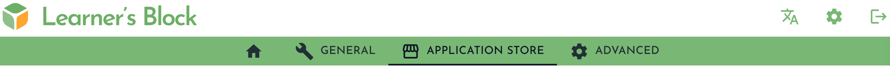
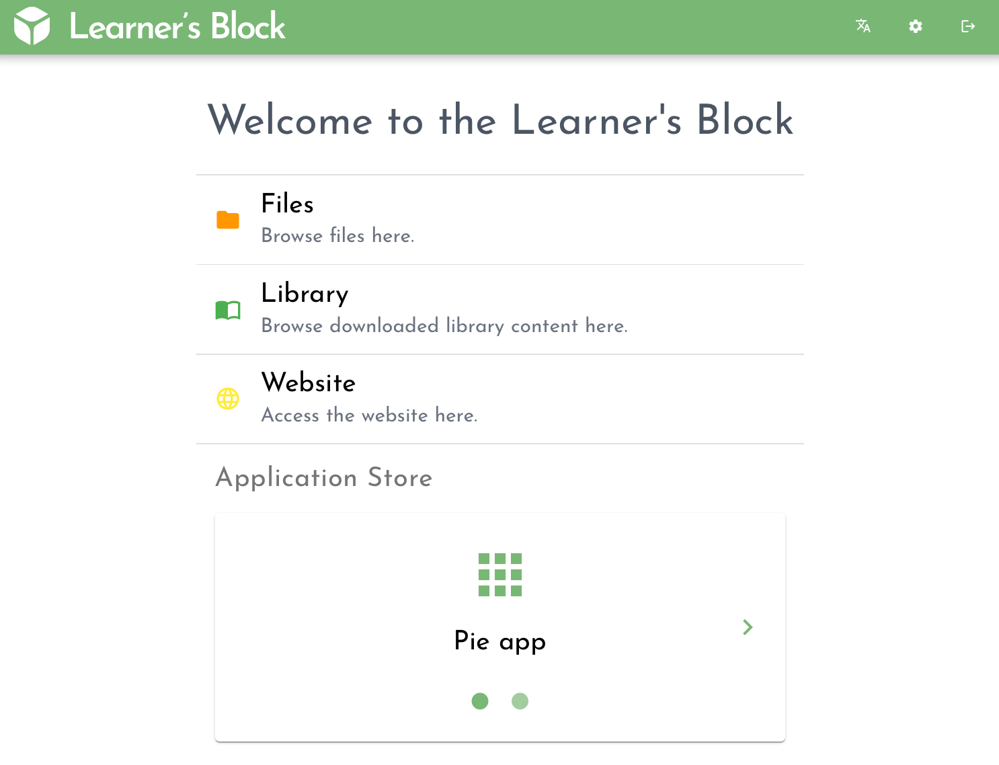

# Using the Application Store

Your Learner's Block has an Application Store allowing one-click installation of popular EdTech platforms.&#x20;

To install from the Application Store, you will need:

1. Internet connectivity via [Wi-Fi ](connecting-to-a-wi-fi-network-optional.md)or [Ethernet](advanced-features/using-an-ethernet-connection.md)
2. Sufficient [space](../how-to-build-one/quickstart/picking-a-micro-sd-card-and-sd-card-reader.md#microsd-card) on your device for the downloaded application


If you would like to know the space required for each application you can find the source containers on [GitHub](https://github.com/LearnersBlock/app-store), although it is unlikely you will encounter issues if you have chosen a [suitable memory card](../how-to-build-one/quickstart/picking-a-micro-sd-card-and-sd-card-reader.md#microsd-card).


## **Installing an Application**

To install an application click the Settings toggle in the top right of the interface .png>).

Click the Application Store tab:

Click the refresh button to fetch the latest list of available applications, then choose an application to install and click 'Install':


Depending on the application you are installing, your internet connection and device resources, this process may take some time. It is not unheard of on slow connections for installs to take up to 10 minutes.&#x20;

Once the install has taken place, it may also take some time for the application to launch, depending on the process developed by the manufacturer.&#x20;


## **Using an Application**

After installing an application it will be available to all users via the frontpage of your Learner's Block. Click the application you want to use to begin:

If you want the installed application to be the first thing people see when they access your Block you can [change the default loading page](advanced-features/changing-the-default-loading-page.md).&#x20;

## **Updating an Application**

To check for available updates, press the refresh button.

If updates are available the button will change to indicate 'Update Available'. Click the button and the update will begin.&#x20;

Updates follow the update procedure of the application provider. This means that if the application provided allows for updates without losing your settings and files then the same will be true for your update on the Learner's Block.&#x20;

## **Removing an Application**

To remove an application click on the label 'Installed' next to the application you want to remove:

Removing an application will remove the running application. Application settings, system files and the content downloaded through the application will remain on the device if the application manufacture has allowed it.


We cannot guarantee the data will be kept when you uninstall an application. Some application designers have not built in such a functionality.



If you want to remove application data to free up space on your Block, you can do so through the applications own interface.



If you want to remove the application system files to free up space on your device, you can [prune the system files](advanced-features/pruning-system-files.md).&#x20;

