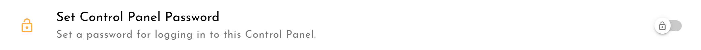
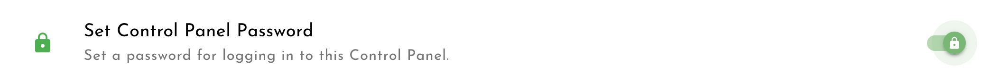

# Setting your password

### Set a password

You can set a password to lock the Control Panel and avoid unauthorised users from change your Block settings. 

Click the Settings cog in the top right of the screen.

In the `Security` section, click `Set Control Panel Password` or slide the toggle:

Follow the prompts to set your new password. 


Learner's Blocks are designed for offline use. This means we cannot provide a password reset facility like you may find in online platforms. Be very careful not to forget your password or you will be locked out indefinitely. 


### Disable the password

If you decide later that you no longer want a password to project the Control Panel, you can disable it again by clicking the with `Set Control Panel Password` or sliding the toggle:

