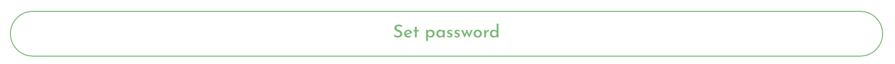
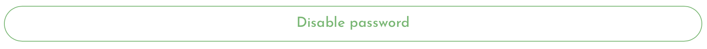

# Setting your password

### Set a password

In the settings panel, there are a number of features you may not want curious people to be poking around with. That is why you can set a password to lock the Settings panel, and we suggest using it. 

Click the Settings cog in the top right of the screen.

Then click the 'Set Password' button:

Follow the prompts to set your new password. 


Learner's Blocks are designed for offline use. This means we cannot provide a password reset facility like you may find in online platforms. Be very careful not to forget your password or you will be locked out indefinitely. 


### Disable the password

If you decide later on that you no longer want a password to project the Settings panel, you can disable it again with the 'Disable Password' button:

