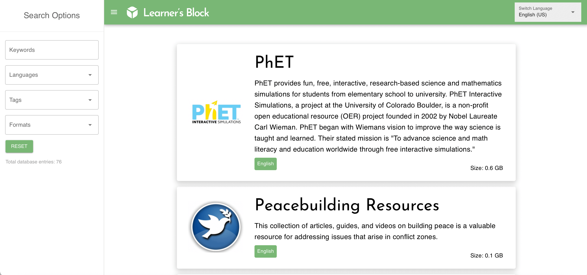

# What is the Library?

The EdTech community has created a wealth of resources in all shapes and sizes. Yet so often they are hard to find, or only work on certain devices.

Our [Library](https://library.learnersblock.org) provides a central platform to access these open-source resources how they were intended: free and open to use how you wish.

Download them directly to your Learner’s Block via the settings panel, or directly from your browser to your computer to use however you see fit.

If you have resources you would like to see added, you can submit the details for consideration via our [form](https://airtable.com/shrkg3MkzXLd7hBts). 

