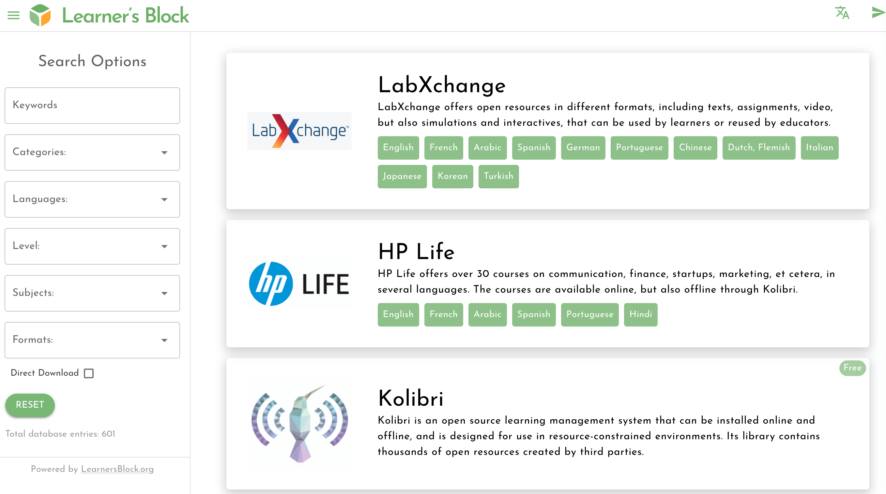

# What is the Library?

The EdTech community has created a wealth of resources in all shapes and sizes. Yet so often they are hard to find, or only work on certain devices.

Our Library provides a central platform to access these open-source resources how they were intended: free and open to use how you wish.

Download them directly to your [Learner’s Block via the Control Panel](../how-to-use-it/adding-resources.md).
