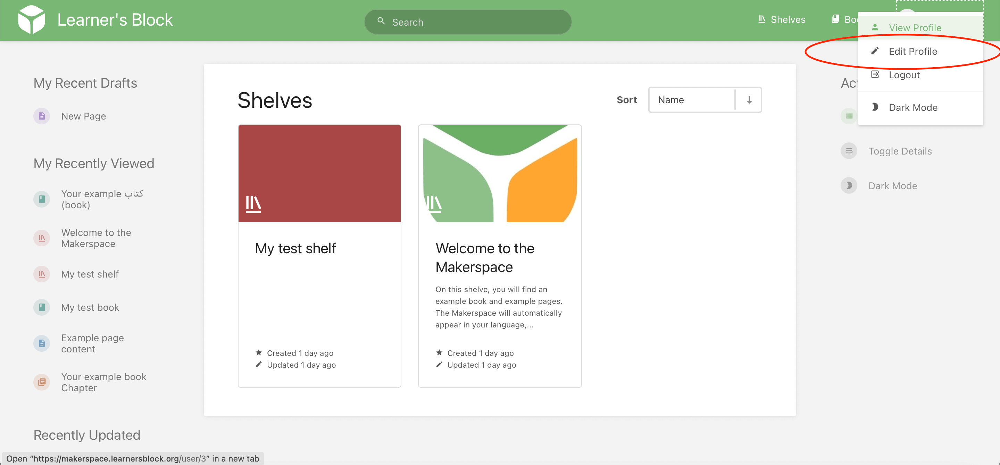

# Change the language

Our Makerspace is multilingual and the language will change based on the language of the computer accessing it. 

If however, you want to change the language, you can do so by going to your profile page:

and then selecting your preferred language from the dropdown menu:

