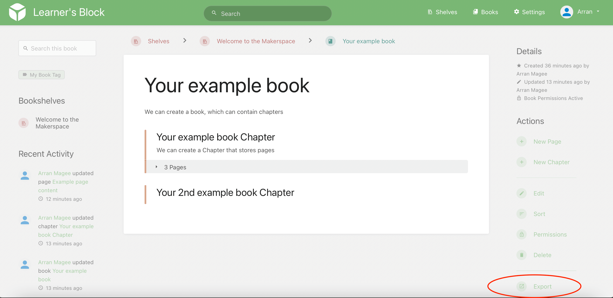

# Exporting content

Head to a Books, Chapters or Pages navigation view, and you will find an "Export" link to download your content in a variety of familiar formats. See the red circle in the bottom right?

