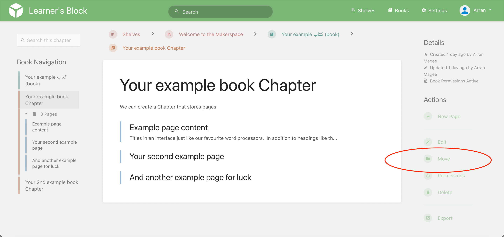
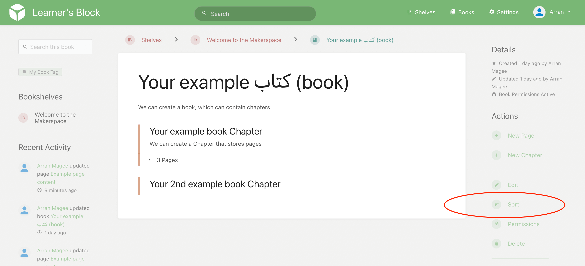

# Organising Content

Once your Makerspace account starts to grow you will find that you may want to re-organise your content. Within the Makerspace there are two options for moving content around; Either you can move pages and chapters individually or you can sort entire books.

#### Moving Single Pages & Chapters

Pages and chapters can be moved directly to a new chapter or book. To move a chapter or page in this way go to a page or chapter and select 'Move' from the navigation bar found on the right-hand side:

Clicking the 'Move' action will take you to a screen where you can select a new location for your chapter or page. Here you can search for a particular book or chapter using the search bar at the top of the selection screen. Once you select a new parent for your chapter or page press 'Move Page' or 'Move Chapter' and your chapter or page will be moved to the new chapter or book. If you move a chapter all child pages will remain in that chapter and any related activity will now show up under the new parent book.

#### Sorting Books

The 'Book Sort' interface allows you to move multiple pages and chapters with ease in a simple drag and drop interface. To sort a book simply go to the book and select 'Sort' in the menu on the right of the page and you will be directed to the sort view.

Initially, just the book you came from will show on the left. You can add extra books into the sort interface by selecting them on the right. Here you can simply drag and drop chapters and pages around and also between different books. Once you have organised your content press 'Save' and all included books will be re-organised.

