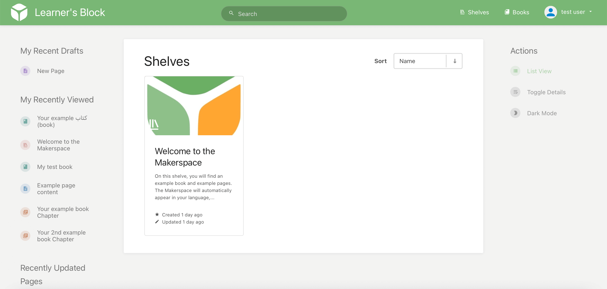

# What is the Makerspace?

The [Learner's Block Makerspace](https://makerspace.learnersblock.org/login) is a free platform for building your own materials for use on Learner's Blocks or on your own computer.

We have used a design familiar to educators the world over. Bringing together the organisational structure of a bookshelf with editing tools that will be familiar to users of Google Docs or Microsoft Word, we aim for ease of use over complex features.

When you contribute a Bookshelf, it becomes public so we can all benefit from open learning resources. When you have made your materials, you can download directly to your Learner’s Block, or export them to your computer in a familiar formats like PDF or HTML.

Our Makerspace is multilingual, and the languages will change based on the language of the computer accessing it. If however, you want to [change the language](../how-to-use-it/setting-the-language.md), you can do so in your Profile page. 

Head over to the [Learner’s Block Makerspace](https://makerspace.learnersblock.org/register) to sign up.

